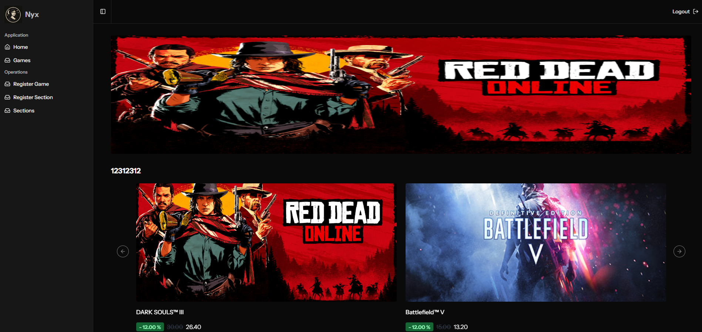

# 🎮 Sistema de Venda de Jogos Digitais

Este projeto é uma aplicação web desenvolvida como parte da disciplina de **Arquitetura de Software**, utilizando o padrão arquitetural **MVC** e a stack **AdonisJS + Inertia.js + React + Tailwind CSS + shadcn/ui + PostgreSQL**.

---

## 📌 Requisitos

Antes de iniciar, certifique-se de ter os seguintes softwares instalados:

- Node.js (v18 ou superior)  
- PostgreSQL  
- npm  
- Git  

---

## 🚀 Tecnologias Utilizadas

- **Backend:** AdonisJS  
- **Frontend:** React + Inertia.js  
- **Estilização:** Tailwind CSS + shadcn/ui  
- **Banco de Dados:** PostgreSQL  

---

## ⚙️ Instalação e Execução Local

### 1. Clone o repositório

```bash
git clone https://github.com/luizh3/nyx
cd nyx
```

### 2. Instale as dependências

```bash
npm install
```

### 3. Configure as variáveis de ambiente

```bash
cp .env.example .env
```

Edite o arquivo `.env` com as configurações do seu banco de dados.

### 4. Rode as migrations do banco

```bash
node ace migration:run
```

### 5. Adicione uma APP_KEY

```bash
node ace key:generate
```

### 6. Inicie o servidor de desenvolvimento

```bash
npm run dev
```

Acesse o sistema em: [http://localhost:3333](http://localhost:3333)

---

## 📧 Microserviço de Confirmação de E-mail

Para o fluxo de confirmação de e-mail, este projeto utiliza um microserviço dedicado ao envio de e-mails de confirmação. Esse microserviço é responsável por consumir mensagens de uma fila (RabbitMQ) e enviar e-mails utilizando SMTP, conforme ilustrado no diagrama abaixo.

### Como rodar o microserviço

1. Acesse o repositório do microserviço de e-mail:
   [https://github.com/FeShimada/email-microservice](https://github.com/FeShimada/email-microservice)
2. Siga as instruções do README desse repositório para instalar as dependências e executar o microserviço localmente.

> **Observação:** Todos os detalhes de configuração, variáveis de ambiente e execução estão descritos no README do repositório do microserviço.

### Arquitetura do Fluxo de Confirmação de E-mail

Abaixo está o diagrama que demonstra a arquitetura e o fluxo de confirmação de e-mail utilizado neste sistema:


---

## 👥 Autores

- Eduardo Romildo Nonemacher – RA000000 – [@github](https://github.com/)
- Felipe Shimada – RA2458080 – [@github](https://github.com/FeShimada)
- Luiz Henrique Scolari Farikoski – RA000000 – [@github](https://github.com/luizh3)

---

## 📄 Licença

Este projeto é de uso exclusivamente acadêmico, sem fins comerciais.

## Imagens 

Imagens do resultado final estão disponíveis na pasta `documentation/images`


